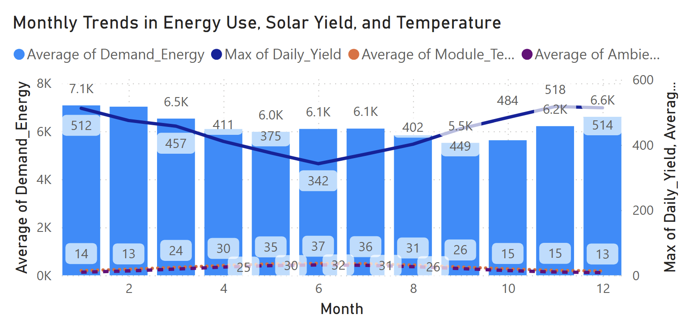
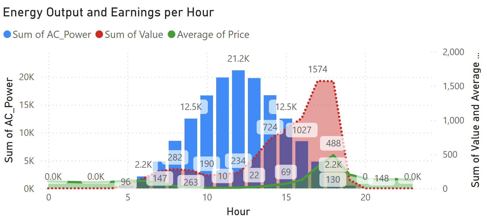
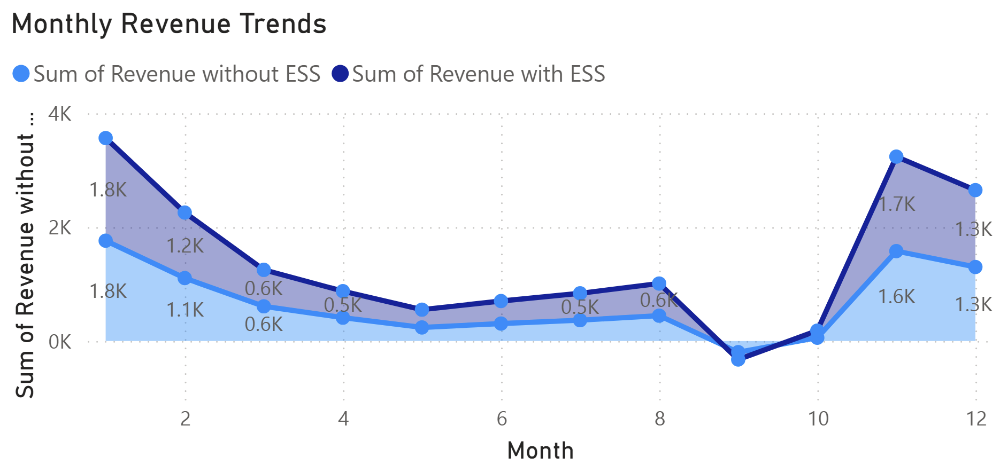

# ☀️ Energy Storage Value Optimization in PV Systems

## 📘 Project Overview

This project analyzes photovoltaic (solar) energy production data, focusing on metrics such as AC/DC power generation, energy efficiency, temperature effects, and revenue trends over time. The interactive dashboard is built using Power BI and showcases insights using sample data to simulate real-world solar grid scenarios.

## 🗂️ About the Dataset

This project combines two complementary data sources to explore solar photovoltaic system performance and market-driven outcomes in diverse environments.

### 1. 🌞 Solar Generation Data (Kaggle)

- **Source**: [Solar Data from Diverse Regions (Kaggle)](https://www.kaggle.com/datasets/examsgovt/solar-data-from-diverse-regions)
- **Scope**: Hourly solar power generation data from **four countries** (Australia, Brazil, India, and Norway) representing distinct climatic zones throughout the **full year of 2024**.
- **Key Variables**:
  - `DC_Power` and `AC_Power`: Raw and inverter output power measurements (kW)
  - `Module_Temperature` and `Ambient_Temperature`: Temperature readings in °C
  - `Irradiance`: Solar irradiance (W/m²)
  - `Daily_Yield`, `Cumulative_Yield`: Energy generation performance (kWh)
  - `Timestamp`: 1-hour interval time series

This dataset enables detailed analysis of **solar performance across geographic, seasonal, and environmental factors**. It is suitable for time series modeling, PV system efficiency studies, and climate-resilient energy planning.

### 2. ⚡ Electricity Market Data (OpenNEM API)

- **Source**: OpenNEM REST API
- **Scope**: Australian electricity market data (2024, hourly resolution)
- **Key Variables**:
  - `Price`: Market electricity price (AUD/MWh)
  - `Demand`: Electricity demand (MW)
  - `Energy_Demanded`: Actual energy supplied (MWh)

By integrating market data with generation data, this project provides a foundation for analyzing **solar revenue potential**, **supply-demand dynamics**, and the **economic viability of PV systems** under varying grid conditions.

---

Let me know if you'd like to add visual schema (like data diagrams or relationships) or a “Data Schema” section! This is a solid, professional foundation for your project.

## 📊 Power BI Interactive Dashboard

[👉 Click here to view the interactive Power BI report](https://app.powerbi.com/view?r=eyJrIjoiMWExMThhMTYtOTQ1Yy00ZWFhLWI1Y2MtM2Y4NDNiY2Q5YTE4IiwidCI6ImJmZjRmNmRiLWU4MGQtNDhkOC1iODQ5LWIxNjc1NmY0NWE1ZSIsImMiOjh9)

⚠️ This report is for portfolio demonstration purposes only and uses sample (non-sensitive) data.

## 📈 Key Metrics and Analytical Dimensions

This dashboard tracks and analyzes a range of key performance indicators (KPIs) related to photovoltaic system operations and market dynamics:

### 🌞 Technical Performance Metrics
- **DC Power Output (kW)**: Direct current output from solar panels before inversion losses.
- **AC Power Output (kW)**: Final alternating current supplied to the grid after inverter conversion.
- **Inverter Efficiency (%)**: Calculated as `AC Power / DC Power`, indicating conversion effectiveness.
- **Daily Yield (kWh)**: Total energy generated each day.
- **Cumulative Yield (kWh)**: Aggregated energy production over time.

### 🌡️ Environmental & Operational Conditions
- **Module Temperature (°C)**: Actual temperature of the solar panel modules.
- **Ambient Temperature (°C)**: Surrounding environmental temperature, influencing efficiency.
- **Solar Irradiance (W/m²)**: Intensity of sunlight received, a direct driver of energy production.
- **Temperature vs. Efficiency Curve**: Insights into how heat affects system performance.

### ⏱️ Temporal Dimensions
- **Hourly Profiles**: Captures intra-day performance patterns (morning peak, noon plateau, evening drop).
- **Daily/Monthly Trends**: Seasonal variations in power generation and environmental factors.
- **Time-of-Day Analysis**: Identifies high-efficiency and low-yield periods.

### ⚡ Electricity Market & Economic Indicators
- **Market Price (AUD/MWh)**: Dynamic electricity pricing data from OpenNEM.
- **Grid Demand (MW)**: Reflects total load on the electricity network.
- **Energy Sold (MWh)**: Actual volume of energy supplied to the grid.
- **Revenue Estimation (AUD)**: Projected income from solar generation (`AC Power * Market Price`).
- **ESS Revenue Boost (%)**: Quantifies the financial benefit from time-shifting energy through battery storage.

### 🔋 Energy Storage Strategy Metrics
- **Charging Windows**: Identifies surplus generation periods (usually low-price hours) ideal for ESS charging.
- **Discharging Windows**: Detects high-price hours suitable for profitable ESS discharge.
- **ESS Utilization Rate**: Measures how efficiently the battery is used throughout the day/year.
- **Revenue Delta (ESS vs. Baseline)**: Tracks income uplift resulting from optimized ESS dispatch.

---

This multi-dimensional metric framework enables a comprehensive analysis of both the **technical health of PV systems** and their **economic impact in the energy market**.

## 📊 Data-Driven Insights

### 🔍 1. Overall System Performance
- **Average Daily Yield**: 207.41 kWh, indicating stable system performance over time.
- **Average Market Price**: 111.58 AUD/MWh, serving as the basis for revenue estimation.
- **Average Hourly Efficiency**: 89.01%, reflecting a highly efficient power conversion rate from DC to AC.
- **Maximum Total Yield**: 151.39KWh at peak, demonstrating strong production capacity under optimal conditions.
- **Total Revenue**: 7.97K AUD, showcasing the system’s economic contribution.

---

### 📈 2. Monthly Trends Overview  

**Chart: _"Monthly Trends in Energy Use, Solar Yield, and Temperature"_**
- **Energy Demand (blue bars)** shows seasonal variation, possibly influenced by climate or consumption patterns.
- **Daily Yield Peaks (red line)** appear to correlate with temperature, with potential output dips in extremely hot months.
- **Module vs. Ambient Temperature (purple vs. green lines)**:
  - Module temperatures consistently exceed ambient temperatures, as expected.
  - High temperatures may negatively impact system efficiency, suggesting the need for temperature-performance analysis.

---

### 🕒 3. Revenue Distribution by Time of Day  

**Chart: _"Earnings by Solar Time Segments"_**
- **Afternoon (39.42%)** and **Morning Peak (32%)** are the most profitable periods.
- **Noon Peak (13%)** contributes less than expected, likely due to heat-induced efficiency loss.
- **Early Morning and Evening** revenues are minimal, in line with solar irradiance patterns.

---

### ⏰ 4. Hourly Output vs. Revenue  

**Chart: _"Energy Output and Earnings per Hour"_**
- **AC Power Output (blue bars)** and **Revenue (red area)** peak before and after noon.
- The close alignment between output and revenue indicates that generation is the primary driver of earnings.

---

### 💰 5. Monthly Revenue Trends  

**Chart: _"Monthly Revenue Trends"_**
> **Highlight peak and off-peak months to prepare for energy storage charging/discharging strategy.**

This chart compares monthly revenue **with and without ESS (Energy Storage System)**.

- **🔼 Peak Months**: January and December show significantly higher revenues.  
  Especially in December, revenue with ESS reaches **1.7K AUD**, about **30% higher** than without ESS.
  
- **🔽 Low Months**: June and July are the lowest revenue months due to reduced solar irradiance and shorter daylight hours.  
  During these periods, ESS offers **limited revenue gain**.

> 💡 **Insight**:  
> ESS charging and discharging should be **time-of-day aware** — charge during low-price periods (midday) and discharge during peak-price hours (afternoon/evening).  
> In low-production months, ESS can be used more for **self-consumption** or **price arbitrage**.

---

## ✅ Strategic Recommendations

> **Turn insights into actions that boost system value.**

1. **💰 ESS improves revenue**:
   - Total revenue increases from **7.97K** to **8.81K AUD**, a **10.5% uplift** with ESS.
   - This gain is primarily due to **discharging during high electricity price periods**.

2. **📈 ROI analysis over time**:
   - ROI peaks in **2030 (732%)**, indicating **long-term profitability** of ESS investment.
   - Negative ROI in **2025 (-17%)** highlights the importance of **understanding payback periods** and early-stage costs.

3. **🔧 Operational Recommendations**:
   - Mitigate efficiency drops during **high-temperature noon hours** by improving ventilation or adjusting panel layout.
   - Schedule **preventive maintenance** during low-yield months (e.g., May–July) to minimize revenue disruption.

---

## 🚀 Next Steps

> **Advance toward intelligent, forecast-driven ESS strategies.**

1. **🔋 Simulate different ESS capacities**:
   - Model various battery capacities (e.g., 10kWh, 20kWh, 50kWh) to compare:
     - **Revenue increase**
     - **ROI trends**
     - **Marginal gain per added capacity**

2. **🤖 Optimize charging/discharging with ML**:
   - Train models (e.g., `XGBoost`, `LightGBM`, `Random Forest`) using features like:
     - Hour of day
     - Electricity price
     - Solar irradiance
     - Module/ambient temperature
     - Historical yield
   - Enable **dynamic, intelligent ESS control** for price-sensitive operations.

3. **📊 Build ROI simulation framework**:
   - Combine:
     - Initial investment
     - Annual maintenance costs
     - Revenue with/without ESS  
   - Output: **10-year ROI projections**, visualized as **ROI curves** for decision-making.

4. **🌤 Integrate forecasting tools**:
   - Use market and weather forecasting APIs to shift from **static scheduling** to **predictive, data-driven control**.
   - Forecast-aware ESS strategies can increase both **revenue** and **grid stability**.

---