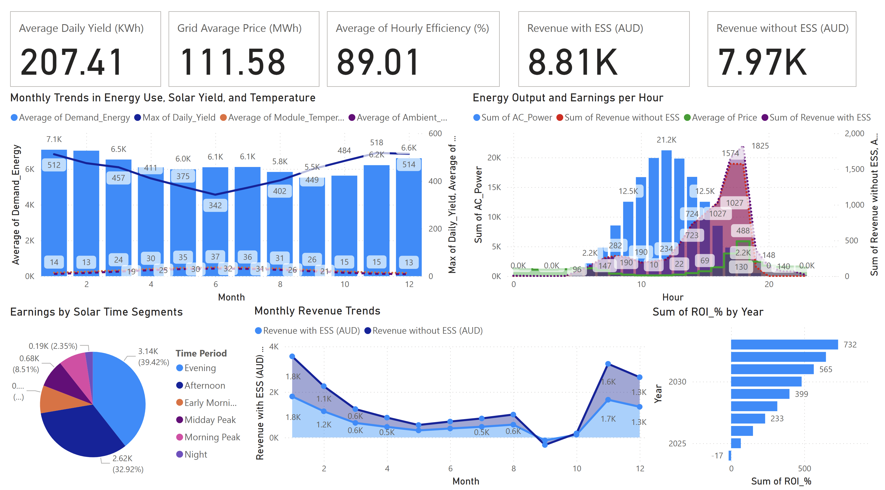

# ☀️ Photovoltaic-Grid-Analysis

## 📘 Project Overview

This project analyzes photovoltaic (solar) energy production data, focusing on metrics such as AC/DC power generation, energy efficiency, temperature effects, and revenue trends over time. The interactive dashboard is built using Power BI and showcases insights using sample data to simulate real-world solar grid scenarios.

## 🗂️ About the Dataset

This project combines two complementary data sources to explore solar photovoltaic system performance and market-driven outcomes in diverse environments.

### 1. 🌞 Solar Generation Data (Kaggle)

- **Source**: [Solar Data from Diverse Regions (Kaggle)](https://www.kaggle.com/datasets/examsgovt/solar-data-from-diverse-regions)
- **Scope**: Hourly solar power generation data from **four countries** (Australia, Brazil, India, and Norway) representing distinct climatic zones throughout the **full year of 2024**.
- **Key Variables**:
  - `DC_Power` and `AC_Power`: Raw and inverter output power measurements (kW)
  - `Module_Temperature` and `Ambient_Temperature`: Temperature readings in °C
  - `Irradiance`: Solar irradiance (W/m²)
  - `Daily_Yield`, `Cumulative_Yield`: Energy generation performance (kWh)
  - `Timestamp`: 1-hour interval time series

This dataset enables detailed analysis of **solar performance across geographic, seasonal, and environmental factors**. It is suitable for time series modeling, PV system efficiency studies, and climate-resilient energy planning.

### 2. ⚡ Electricity Market Data (OpenNEM API)

- **Source**: OpenNEM REST API
- **Scope**: Australian electricity market data (2024, hourly resolution)
- **Key Variables**:
  - `Price`: Market electricity price (AUD/MWh)
  - `Demand`: Electricity demand (MW)
  - `Energy_Demanded`: Actual energy supplied (MWh)

By integrating market data with generation data, this project provides a foundation for analyzing **solar revenue potential**, **supply-demand dynamics**, and the **economic viability of PV systems** under varying grid conditions.

---

Let me know if you'd like to add visual schema (like data diagrams or relationships) or a “Data Schema” section! This is a solid, professional foundation for your project.

## 📊 Power BI Interactive Dashboard

[👉 Click here to view the interactive Power BI report](https://app.powerbi.com/view?r=eyJrIjoiMWExMThhMTYtOTQ1Yy00ZWFhLWI1Y2MtM2Y4NDNiY2Q5YTE4IiwidCI6ImJmZjRmNmRiLWU4MGQtNDhkOC1iODQ5LWIxNjc1NmY0NWE1ZSIsImMiOjh9)

⚠️ This report is for portfolio demonstration purposes only and uses sample (non-sensitive) data.

## 📈 Key Metrics and Analytical Dimensions

This dashboard tracks and analyzes a range of key performance indicators (KPIs) related to photovoltaic system operations and market dynamics:

### 🌞 Technical Performance Metrics
- **DC Power Output (kW)**: Direct current output from solar panels before inversion losses.
- **AC Power Output (kW)**: Final alternating current supplied to the grid after inverter conversion.
- **Inverter Efficiency (%)**: Calculated as `AC Power / DC Power`, indicating conversion effectiveness.
- **Daily Yield (kWh)**: Total energy generated each day.
- **Cumulative Yield (kWh)**: Aggregated energy production over time.

### 🌡️ Environmental & Operational Conditions
- **Module Temperature (°C)**: Actual temperature of the solar panel modules.
- **Ambient Temperature (°C)**: Surrounding environmental temperature, influencing efficiency.
- **Solar Irradiance (W/m²)**: Intensity of sunlight received, a direct driver of energy production.
- **Temperature vs. Efficiency Curve**: Insights into how heat affects system performance.

### ⏱️ Temporal Dimensions
- **Hourly Profiles**: Captures intra-day performance patterns (morning peak, noon plateau, evening drop).
- **Daily/Monthly Trends**: Seasonal variations in power generation and environmental factors.
- **Time-of-Day Analysis**: Identifies high-efficiency and low-yield periods.

### ⚡ Electricity Market & Economic Indicators
- **Market Price (AUD/MWh)**: Dynamic electricity pricing data from OpenNEM.
- **Grid Demand (MW)**: Reflects total load on the electricity network.
- **Energy Sold (MWh)**: Actual volume of energy supplied to the grid.
- **Revenue Estimation (AUD)**: Projected income from solar generation (`AC Power * Market Price`).

### ⚠️ Anomaly & Diagnostic Insights
- **Underperformance Flags**: Detects dips in output relative to irradiance.
- **Weather-related Dropouts**: Identifies possible losses due to cloud cover or environmental conditions.
- **Inverter Drop Events**: Sudden zero-AC-output periods that may require maintenance attention.

---

This multi-dimensional metric framework enables a comprehensive analysis of both the **technical health of PV systems** and their **economic impact in the energy market**.

## 📁 Project Structure

- `dashboard/`: Contains Power BI dashboard files.
- `data/`: Includes sample datasets used for analysis.
- `images/`: Stores images used in the README and documentation.

## 📊 Data-Driven Insights (Preliminary)

Based on the current sample data and dashboard visualization, the following preliminary insights can be observed:

- **Power Generation Trends:** The photovoltaic system shows a clear daily and seasonal pattern in AC and DC power outputs, with peak generation typically occurring during midday hours.
- **Efficiency Variations:** Calculated system efficiency (AC power divided by DC power) fluctuates throughout the day, often decreasing during high ambient temperatures, indicating thermal impacts on inverter performance.
- **Temperature Effects:** There is a noticeable negative correlation between module temperature and power output, suggesting that higher temperatures may reduce photovoltaic efficiency.
- **Revenue Estimation:** Revenue correlates closely with power generation patterns, highlighting the financial impact of environmental conditions and system performance.
- **Anomaly Detection:** Preliminary observations suggest occasional dips in power output that may be linked to transient weather conditions or equipment issues, warranting further investigation.

These insights will be refined and expanded as more data is analyzed and additional features are incorporated into the dashboard.

## 🚀 Next Steps

- Perform detailed data analysis to identify key performance drivers.
- Enhance dashboard with efficiency and anomaly detection metrics.
- Incorporate real-world datasets for more robust insights.